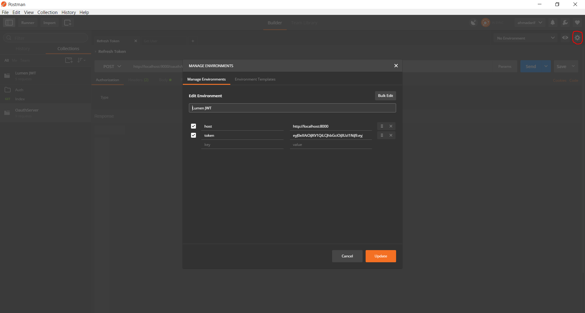

# Lumen with JWT Authentication
Basically this is a starter kit for you to integrate Lumen with [JWT Authentication](https://jwt.io/).
If you want to Lumen + Dingo + JWT for your current application, please check [here](https://github.com/krisanalfa/lumen-dingo-adapter).

## What's Added

- [Lumen 5.3](https://github.com/laravel/lumen/tree/v5.3.0).
- [JWT Auth](https://github.com/tymondesigns/jwt-auth) for Lumen Application.
- [Dingo](https://github.com/dingo/api) to easily and quickly build your own API.
- [Lumen Generator](https://github.com/flipboxstudio/lumen-generator) to make development even easier and faster.
- [Lumen Dingo Route List](https://github.com/widnyana/lumen-dingo-route-list) to show all the route list of dingo.
- [CORS and Preflight Request](https://developer.mozilla.org/en-US/docs/Web/HTTP/Access_control_CORS) support.

## Quick Start

- Clone this repo or download it's release archive and extract it somewhere
- You may delete `.git` folder if you get this code via `git clone`
- Run `composer install`
- Run `php artisan key:generate`
- Run `php artisan jwt:generate`
- Configure your `.env` file for authenticating via database
- Set the `API_PREFIX` parameter in your .env file (usually `api`).
- Run `php artisan migrate --seed`

## A Live PoC

- Run a PHP built in server from your root project:

```sh
php -S localhost:8000 -t public/
```

Or via bat file (windows):

```sh
run-server
```

To authenticate a user, make a `POST` request to `/api/auth/login` with parameter as mentioned below:

```
email: ahmadarif@mail.com
password: 123
```

Request:

```sh
curl -X POST -F "email=ahmadarif@mail.com" -F "password=123" "http://localhost:8000/api/auth/login"
```

Response:

```
{
  "success": {
    "message": "Login success",
    "token": "TOKEN_HERE"
  }
}
```

- With token provided by above request, you can check authenticated user by sending a `GET` request to: `/api/auth/user`.

Request:

```sh
curl -X GET -H "Authorization: Bearer TOKEN_HERE" "http://localhost:8000/api/auth/user"
```

Response:

```
{
  "success": {
    "user": {
      "id": 1,
      "name": "Ahmad Arif",
      "email": "ahmadarif@mail.com"
    }
  }
}
```

- To refresh your token, simply send a `PATCH` request to `/api/auth/refresh`.
- Last but not least, you can also invalidate token by sending a `DELETE` request to `/api/auth/invalidate`.
- To list all registered routes inside your application, you may execute `php artisan api:list-route`

```
⇒  php artisan api:list-route
+------+----------+---------------------+----------------+-----------------------------------------------------------+---------------------------+-----------+------------+----------+------------+
| Host | Method   | URI                 | Name           | Action                                                    | Middleware                | Protected | Version(s) | Scope(s) | Rate Limit |
+------+----------+---------------------+----------------+-----------------------------------------------------------+---------------------------+-----------+------------+----------+------------+
|      | POST     | api/auth/login      | api.auth.login | App\Http\Controllers\Auth\AuthController@postLogin        | api.controllers           | No        | v1         |          |            |
|      | GET|HEAD | api/auth/user       |                | App\Http\Controllers\Auth\AuthController@getUser          | api.controllers, api.auth | Yes       | v1         |          |            |
|      | GET|HEAD | api                 |                | App\Http\Controllers\APIController@getIndex               | api.controllers, api.auth | Yes       | v1         |          |            |
|      | PATCH    | api/auth/refresh    |                | App\Http\Controllers\Auth\AuthController@patchRefresh     | api.controllers, api.auth | Yes       | v1         |          |            |
|      | DELETE   | api/auth/invalidate |                | App\Http\Controllers\Auth\AuthController@deleteInvalidate | api.controllers, api.auth | Yes       | v1         |          |            |
+------+----------+---------------------+----------------+-----------------------------------------------------------+---------------------------+-----------+------------+----------+------------+
```

## Postman Project
You can use this postman project, please check [here](https://www.getpostman.com/collections/f4b5756d01aab885344e)

Configuration Environment


## Reference
- Base project : https://github.com/krisanalfa/lumen-jwt